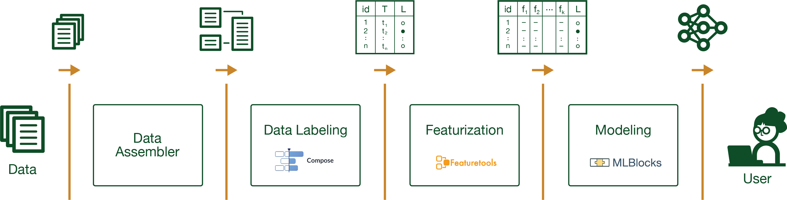

<p align="center"> 

</p>


[](https://pypi.org/search/?c=Development+Status+%3A%3A+2+-+Pre-Alpha)
[](https://pypi.python.org/pypi/cardea)
[](https://github.com/MLBazaar/Cardea/actions?query=workflow%3A%22Run+Tests%22+branch%3Amaster)
[](https://mybinder.org/v2/gh/MLBazaar/Cardea/master?filepath=notebooks)
[](https://docs.google.com/document/d/1h0-l7UFe9ELhP52RgyhwiK-nTNX6bs-Zowy7d7av1fM/edit?usp=sharing)

# Cardea

*This library is under development. Please contact dai-lab@mit.edu or any of the contributors for more information.*

* License: [MIT](https://github.com/MLBazaar/Cardea/blob/master/LICENSE)
* Development Status: [Pre-Alpha](https://pypi.org/search/?c=Development+Status+%3A%3A+2+-+Pre-Alpha)
* Homepage: https://github.com/MLBazaar/Cardea
* Documentation: https://MLBazaar.github.io/Cardea

## Join our Slack Workspace

If you want to be part of the Cardea community to receive announcements of the latest releases,
ask questions, or suggest new features, please join our Slack Workspace!

[](https://docs.google.com/document/d/1h0-l7UFe9ELhP52RgyhwiK-nTNX6bs-Zowy7d7av1fM/edit?usp=sharing)

# Overview

Cardea is a machine learning library built on top of *schemas* that support electronic health records (EHR). The library uses a number of AutoML tools developed under [The MLBazaar Project](https://mlbazaar.github.io/) at [Data to AI Lab at MIT](https://dai.lids.mit.edu/).


Our goal is to provide an easy to use library to develop machine learning models from electronic health records. A typical usage of this library will involve interacting with our API to develop prediction models.

 

A series of sequential processes are applied to build a machine learning model. These processes are triggered using our following APIs to perform the following:

* loading data using the automatic **data assembler**, where we capture data from its raw format into an entityset representation.

* **data labeling** where we create label times that generates (1) the time point that indicates the time before which the data is used to create features (2) the encoded labels of the prediction task. this is essential for our feature engineering phase.

* **featurization** for which we automatically generate features from our data to generate a feature matrix [Using Featuretools](https://github.com/alteryx/featuretools).

* lastly, we build, train, and tune our machine learning modeling pipeline using the **modeling** component [Using MLBlocks](https://github.com/MLBazaar/MLBlocks) and [MLPrimitives](https://github.com/MLBazaar/MLPrimitives).

to learn more about how we structure our machine learning process and our data structures, read our documentation [here](https://MLBazaar.github.io/Cardea).


# Quickstart

## Install with pip


The easiest and recommended way to install **Cardea** is using [pip](https://pip.pypa.io/en/stable/):

```bash
pip install cardea
```

This will pull and install the latest stable release from [PyPi](https://pypi.org/).

## Quickstart

In this short tutorial we will guide you through a series of steps that will help you get Cardea started.

First, load the core class to work with:

```python3
from cardea import Cardea

cardea = Cardea()
```

We then seamlessly plug in our data. Here in this example, we are loading a pre-processed version of the [Kaggle dataset: Medical Appointment No Shows](https://www.kaggle.com/joniarroba/noshowappointments). 
To use this dataset download the data from here then unzip it in the root directory, or run the command:

```bash
curl -O https://dai-cardea.s3.amazonaws.com/kaggle.zip && unzip -d kaggle kaggle.zip
```
To load the data, supply the ``data`` to the loader using the following command:

```python3
cardea.load_entityset(data='kaggle')
```
> :bulb: To load local data, pass the folder path to ``data``.

To verify that the data has been loaded, you can find the loaded entityset by viewing ``cardea.es`` which should output the following:

```bash
Entityset: kaggle
  Entities:
    Address [Rows: 81, Columns: 2]
    Appointment_Participant [Rows: 6100, Columns: 2]
    Appointment [Rows: 110527, Columns: 5]
    CodeableConcept [Rows: 4, Columns: 2]
    Coding [Rows: 3, Columns: 2]
    Identifier [Rows: 227151, Columns: 1]
    Observation [Rows: 110527, Columns: 3]
    Patient [Rows: 6100, Columns: 4]
    Reference [Rows: 6100, Columns: 1]
  Relationships:
    Appointment_Participant.actor -> Reference.identifier
    Appointment.participant -> Appointment_Participant.object_id
    CodeableConcept.coding -> Coding.object_id
    Observation.code -> CodeableConcept.object_id
    Observation.subject -> Reference.identifier
    Patient.address -> Address.object_id
```

The output shown represents the entityset data structure where ``cardea.es`` is composed of entities and relationships. You can read more about entitysets [here](https://mlbazaar.github.io/Cardea/basic_concepts/data_loading.html).

From there, you can select the prediction problem you aim to solve by specifying the name of the class, which in return gives us the ``label_times`` of the problem.

```python3
label_times = cardea.select_problem('MissedAppointment')
```

``label_times`` summarizes for each instance in the dataset (1) what is its corresponding label of the instance and (2) what is the time index that indicates the timespan allowed for calculating features that pertain to each instance in the dataset.

```bash
          cutoff_time     instance_id        label
0 2015-11-10 07:13:56	      5030230       noshow
1 2015-12-03 08:17:28	      5122866    fulfilled
2 2015-12-07 10:40:59	      5134197    fulfilled
3 2015-12-07 10:42:42	      5134220       noshow
4 2015-12-07 10:43:01	      5134223       noshow
```

You can read more about ``label_times`` [here](https://mlbazaar.github.io/Cardea/basic_concepts/machine_learning_tasks.html).

Then, you can perform the AutoML steps and take advantage of Cardea. 

Cardea extracts features through automated feature engineering by supplying the ``label_times`` pertaining to the problem you aim to solve

```python3
feature_matrix = cardea.generate_features(label_times[:1000])
```
> :warning: Featurizing the data might take a while depending on the size of the data. For demonstration, we only featurize the first 1000 records.

Once we have the features, we can now split the data into training and testing

```python3
y = list(feature_matrix.pop('label'))

X = feature_matrix.values

X_train, X_test, y_train, y_test = cardea.train_test_split(
	X, y, test_size=0.2, shuffle=True)
```

Now that we have our feature matrix properly divided, we can use to train our machine learning pipeline, Modeling, optimizing hyperparameters and finding the most optimal model

```python3
cardea.select_pipeline('Random Forest')
cardea.fit(X_train, y_train)
y_pred = cardea.predict(X_test)
```

Finally, you can evaluate the performance of the model
```python3
cardea.evaluate(X, y, test_size=0.2, shuffle=True)
```
which returns the scoring metric depending on the type of problem
```bash
{'Accuracy': 0.75, 
 'F1 Macro': 0.5098039215686274, 
 'Precision': 0.5183001719479243, 
 'Recall': 0.5123528436411872}
```

# Citation
If you use Cardea for your research, please consider citing the following paper:

Sarah Alnegheimish; Najat Alrashed; Faisal Aleissa; Shahad Althobaiti; Dongyu Liu; Mansour Alsaleh; Kalyan Veeramachaneni. [Cardea: An Open Automated Machine Learning Framework for Electronic Health Records](https://arxiv.org/abs/2010.00509). [IEEE DSAA 2020](https://ieeexplore.ieee.org/document/9260104).

```bash
@inproceedings{alnegheimish2020cardea,
  title={Cardea: An Open Automated Machine Learning Framework for Electronic Health Records},
  author={Alnegheimish, Sarah and Alrashed, Najat and Aleissa, Faisal and Althobaiti, Shahad and Liu, Dongyu and Alsaleh, Mansour and Veeramachaneni, Kalyan},
  booktitle={2020 IEEE 7th International Conference on Data Science and Advanced Analytics (DSAA)},
  pages={536--545},
  year={2020},
  organization={IEEE}
}
```
