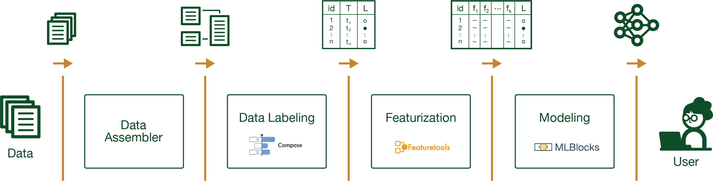

.. raw:: html

   

   
   <i>An open source project from Data to AI Lab at MIT.</i>
   

|Development Status| |PyPi Shield| |Run Tests Shield| |Downloads| |Binder|

Welcome to Cardea
==================

.. figure:: images/cardea-logo.png
   :width: 200 px
   :alt: Cardea Logo

*This library is under development. Please contact dai-lab@mit.edu or any of the contributors for more information.*

**Date**: |today| **Version**: |version|

-  License: `MIT <https://github.com/MLBazaar/Cardea/blob/master/LICENSE>`__
-  Development Status:
   `Pre-Alpha <https://pypi.org/search/?c=Development+Status+%3A%3A+2+-+Pre-Alpha>`__
-  Documentation: https://mlbazaar.github.io/Cardea/
-  Homepage: https://github.com/MLBazaar/Cardea

Overview
--------

*This library is under development. Please contact dai-lab@mit.edu or any of the contributors for more information.*

Cardea is a machine learning library built on top of *schemas* that support electronic health records (EHR). The library uses a number of AutoML tools developed under `The Human Data Interaction Project`_ at
`Data to AI Lab at MIT`_.

Our goal is to provide an easy to use library to develop machine learning models from electronic health records. A typical usage of this library will involve interacting with our API to develop prediction models.

Machine Learning Process
~~~~~~~~~~~~~~~~~~~~~~~~
Cardea is composed of a series of sequential processes that are applied to organize, structure, and build machine learning models on electronic health records datasets. These processes are visualized in the following diagram, where each block represents a process and the output of that process will be used by the succeeding block.

Diving into this diagram more thoroughly:

* we first load the desired data using the **data assembler** to generate an entityset representation of the data. The entityset datastructure contains the entities (tables) and the relationships that occur between these tables. Read more about the :ref:`data_assembler`.

* next, you can investigate the given entityset and decide which prediction problem you wish to solve by using the **data labeler**. Based on the desired prediction problem, cardea creates ``label_times`` which is a data representation, specifically a ``pandas.DataFrame`` that contains three columns:

    * an *instance id* that is unique per row.
    * a *time index* that indicates the timespan in which I can use the data in that timespan to generate the corresponding features for the associated instance.
    * a *label* that denotes what the framework is trying to predict given the selected problem.

You can read more about the :ref:`data_labeler`. It is important to note that ``label_times`` is an essential input to the featurization process.

* then we can automatically engineer features of our entityset using the **featurizer** by supplying ``label_time``. This will generate a ``feature_matrix`` that contains the instance, its extracted features, and its label. Visit :ref:`featurizer` for more information.

* lastly comes the **modeling** process. In this block, we use the generated ``feature_matrix`` to train our model, tune it, and then assess its performance. More on pipeline training and hyperparameter tuning is provided in the :ref:`modeler` section.

This was a quick overview on how we designed the cardea framework. For further details on each process and the data structures in each block, please visit the page of the corresponding process.

Explore Cardea
--------------

* `Getting Started <getting_started/index.html>`_
* `User Guides <user_guides/index.html>`_
* `API Reference <api_reference/index.html>`_
* `Developer Guides <developer_guides/index.html>`_
* `Release Notes <history.html>`_

--------------

.. |Development Status| image:: https://img.shields.io/badge/Development%20Status-2%20--%20Pre--Alpha-yellow
   :target: https://pypi.org/search/?c=Development+Status+%3A%3A+2+-+Pre-Alpha
.. |PyPi Shield| image:: https://img.shields.io/pypi/v/cardea.svg
   :target: https://pypi.python.org/pypi/cardea
.. |Run Tests Shield| image:: https://github.com/MLBazaar/Cardea/workflows/Run%20Tests/badge.svg
   :target: https://github.com/MLBazaar/Cardea/actions?query=workflow%3A%22Run+Tests%22+branch%3Amaster
.. |Downloads| image:: https://pepy.tech/badge/cardea
   :target: https://pepy.tech/project/cardea
.. |Binder| image:: https://mybinder.org/badge_logo.svg
   :target: https://mybinder.org/v2/gh/MLBazaar/Cardea/master?filepath=notebooks

.. toctree::
    :maxdepth: 3
    :hidden:
    :titlesonly:

    getting_started/index
    user_guides/index
    api_reference/index
    developer_guides/index
    Release Notes <history>

.. _FHIR: https://www.hl7.org/fhir/
.. _The Human Data Interaction Project: https://github.com/HDI-Project
.. _Data to AI Lab at MIT: https://dai.lids.mit.edu/